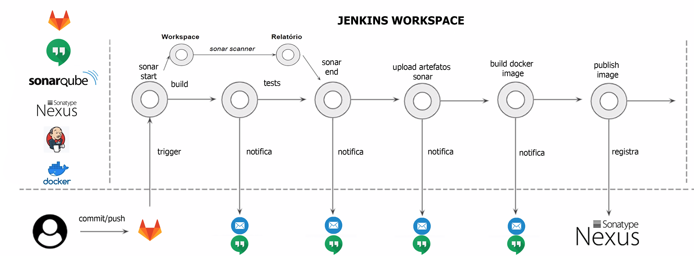

# Docker/Jenkins

#### PIPELINE EM ANDAMENTO ...

#### Repositorio utilizado para guardar os arquivos de configuracao da esteira devops da ZARP

#### Atualmente a esteira devops da ZS conta com as seguintes tecnologias

- Jenkins
- Git
- Docker
- SonarQube
